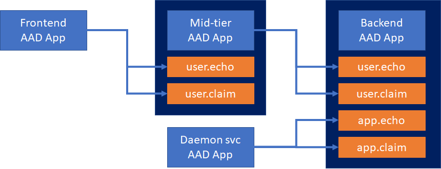
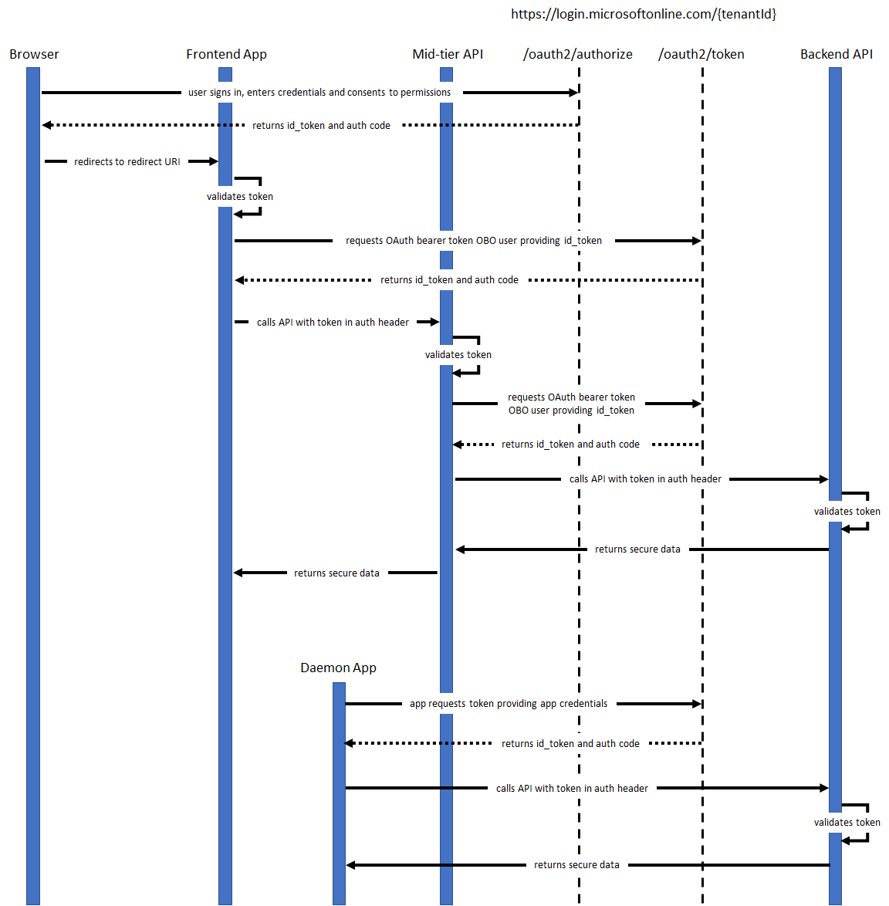

# MultitierApp
Multi-tier application built on Azure app services and Azure functions and secured with Azure Active Directory authentication &amp; authorization

### Backend API
This solution is an Azure function v2.2 that provides the following endpoints:
* Echo: Returns the message passed in the request back to the requester. It allows the scopes [ **user.echo**, **app.echo** ].
* Claim: Returns the claims principal list from the requester identity. It allows the scopes [ **user.claim**, **app.claim** ].

### Mid-tier API
This solution is an Azure function v2.2 that serves as a middle tier to call the Backend API on behalf of the user.

It contains 2 functions:
* Echo: Calls the **echo** method from backend API. It requests the backend API scope **user.echo**.
* UserClaim: Calls the **userclaim** method from the backend API. It requests the backend API scope **user.claim**.

### Frontend App
This solution is an AngularJS and ASP.NET Core 2.2 web API. For convenience, the API is configured to leverage the Azure app services authN & authZ feature with Azure Active Directory.

It contains 2 controllers:
* Auth: This controller contains 1 endpoint:
  * IdToken: Returns the id_token provided by the EasyAuth service from Azure App Services.
* Frontend: This controller contains 3 endpoints:
  * Echo: Calls the **echo** method from mid-tier API.
  * UserClaim: Calls the **userclaim** method from the mid-tier API.
  * ServiceClaim: Calls the **serviceclaim** method from the mid-tier API.

### Daemon App
This solution is an Azure function v2.2 that calls the Backend API using service credentials. It calls the following endpoints:
* /echo/{message}
* /claim

## AAD registered applications permissions flow

## App authentication flow

